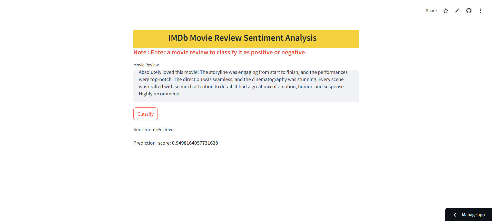

<h1 style="color: #1c2833; background-color: #FFBF00 ; text-align:center; font-weight:bold;">IMDb Movie Review Sentiment Analysis</h1>

    This project performs sentiment analysis on IMDb movie reviews using a Simple Recurrent Neural Network (RNN). 
    The goal is to classify movie reviews as positive or negative based on the text content, achieving an impressive 90% accuracy.

<h2>Project Overview</h2>
<ul>
    <li>Built a sentiment analysis model using an RNN architecture.</li>
    <li>Classified IMDb movie reviews into positive or negative sentiments.</li>
    <li>Achieved a high accuracy of 90% in sentiment prediction.</li>
</ul>

<h2>Data Source</h2>

    IMDb movie reviews dataset.

<h2>Tools & Technologies</h2>
<ul>
    <li><strong>Programming Languages:</strong> Python</li>
    <li><strong>Libraries:</strong> NumPy, Pandas, TensorFlow, Keras, Matplotlib, Seaborn</li>
    <li><strong>Development Tools:</strong> Jupyter Notebook, VS Code, Git</li>
</ul>

<h2>Key Features</h2>
<ul>
    <li>Comprehensive text preprocessing, including tokenization and padding.</li>
    <li>Development and training of a Simple RNN for sentiment classification.</li>
    <li>Evaluation and validation to ensure high model performance.</li>
</ul>

<h2>Usage</h2>
<ol>
    <li>Clone this repository: <code>git clone https://github.com/YourUsername/IMDb-Sentiment-Analysis.git</code></li>
    <li>Install required dependencies: <code>pip install -r requirements.txt</code></li>
    <li>Run the notebook or script to train and evaluate the model.</li>
</ol>

<h2>Results</h2>

    The model achieved a <strong>90% accuracy</strong> in classifying movie reviews as positive or negative, 
    demonstrating its effectiveness in sentiment analysis tasks.

<h2>Contributions</h2>

    Contributions are welcome! Feel free to fork this repository, create a branch, and submit a pull request.

